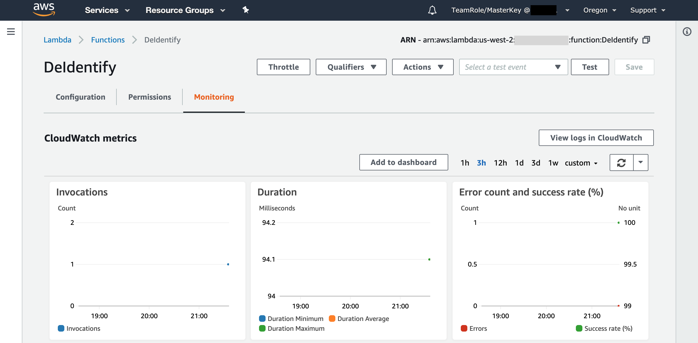

## Collect & De-Identify Data

In this module, you'll see how you can ingest real-time sensor data into **AWS IoT Core**, process it using an **IoT Lambda Rule**, and batch incoming data into S3 using **Kinesis Firehose**. In this case, the Lambda Rule is used to strip the PHI/PII attributes from the incomind data before further processing.

### What was Created

The CloudFormation template deployed the following:


* A **Publish** Lambda function that simulates sensor data and publishes the data to **LifeSupportDevice/#** IoT Core MQTT Topics.
* A **De-Identify** Lambda function that performs the de-identification, triggered by data coming into **LifeSupportDevice/#** MQTT Topics.
* A **PatientReference** DynamoDB table that stores encrypted cross-reference data (PUT there by the **De-Identify** Lambda function).

### Manually Test the Pipeline
Before you start feeding simulated data into the pipeline, you can test the pipeline manually by publishing sensor data to the **LifeSupportDevice/#** MQTT Topic. 

Note the **#** wildcard at the end of the topic name. Since this company deploys machines at many hospitals, they want to be able to organize incoming data by hospital location. Sensor data from life support machines are being published to subtopics such as **LifeSupportDevice/Hospital05/**. You can read more about IoT topics & wildcards [here][iot-topic].

1. In the IoT Core console, subscribe to the **LifeSupportDevice/#** topic

	<details><summary><strong>Step by Step Instructions</strong></summary>

	1. Go to the **IoT Core** Console.

	1. Navigate to the **Test** tab in the left panel.

	1. If you have never used IoT Core in this region, you will see the message "We are provisioning a Device Gateway endpoint for your account..." If so, wait a few minutes and try again.

	1. Type **LifeSupportDevice/#** into the **Subscription topic** text box and click **Subscribe to topic**

	
	
	</details>
	
1. Publish the following sample data to a LifeSupportDevice subtopic.

	```
	{
	  "timestamp": "2018-01-27T05:11:50",
	  "device_id": "device8431",
	  "patient_id": "patient9949",
	  "name": "Lastname, Firstname",
	  "dob": "08/27/1972",
	  "temp": 100.3,
	  "pulse": 108.6,
	  "oxygen_percent": 48.4,
	  "systolic": 110.2,
	  "diastolic": 75.6
	}
	```
	
	<details><summary><strong>Step by Step Instructions</strong></summary>

	1. From the previous step, you have been taken to a view where you can publish directly to the topic. In the code box, delete the existing MQTT message and paste the sample data from above.
		
	1. You will need to **replace the # wildcard** with a value in order to Publish. The simulated data will be publishing to subtopics: **LifeSupportDevice/HospitalXX**, where the Xs are digits.

		

	1. Click **Publish to Topic**. You should immediately see the same message pop up in the window below the code box. Later on, when there is incoming data, you can see it stream in at this same console.

	</details>

1. Look at **IoT Actions** for the action used by this architecture to trigger the **DeIdentify** Lambda function.

	<details><summary><strong>Step by Step Instructions</strong></summary>

	1. Go to the **Act** tab in the left panel.

	1. Click on the rule called **\<stack-name\>DeIdentifyIoTXXXX**, where \<stack-name\> is what you called the CloudFormation stack during Set Up.

		> If you're at an event where set up was done for you, look for a rule called **streamingworkshopDeIdentifyIoTXXXX**.

	1. Since the query is `SELECT * FROM 'LifeSupportDevice/#'`, all of the messages sent to the **LifeSupportDevice/#** topic trigger the Lambda function. 

	1. You can see here that this IoT Action is invoking the **DeIdentify** Lambda function.

	</details>

	> If you have a use case where you don't want to send all of the data along the rest of the pipeline, you can alter this query to filter the data or only send some attributes. You can read more about IoT Core supported SQL statements [here][iot-sql].

1. Go check to see if the **DeIdentify** Lambda function has been invoked. Check the code and/or logs to see exactly what's happening.
	
	<details><summary><strong>Step by Step Instructions</strong></summary>

	1. Go to the **Lambda** console by clicking the **Services** dropdown in the top left corner.

	1. Click on the **DeIdentify** Lambda function.

	1. Under the **Monitoring** tab, you can see quick stats on invocation and errors, etc. Since you only sent one message so far, you should only see one dot in each of these graphs.

		

	1. You can see more detail about invocations by clicking on **View logs in CloudWatch**.

	1. Click on the latest (closest to the top) **Log Stream**.

	1. You should see something like this:

		

		> From these logs, you can see that something was put into a **DynamoDB** table, a **de-identified message** with PII/PHI data removed was created, and then was put into a **Kinesis Firehose**. 
	
	</details>

1. Go to the **DynamoDB** console and look at the **PatientReference** table to confirm that there is now an item indexed by patient_id and timestamp with the PHI/PII data from the sensor data message.

	<details><summary><strong>Step by Step Instructions</strong></summary>

	1. Go to the **DynamoDB** Console.
	1. In the left-hand panel, click on **Tables**.
	1. Go to the **PatientReference** Table.
	1. Click on the **Items** tab.

	
	
	</details>

	> The table is encrypted at rest using KMS, but you can see the un-encrypted data in the console since DynamoDB decrypts the data transparently for local viewing. You can read more about encryption at rest in DynamoDB [here][dynamo-encryption].

### Simulate Sensor Data
Now you will use a scheduled CloudWatch Event to trigger the **Publish** Lambda function and automatically send simulated sensor data into the pipeline you just walked through.

1. Create a **CloudWatch Rule** to trigger the **Publish** function **every 1 minute**.

	<details><summary><strong>Step by Step Instructions</strong></summary>

	1. Go to the **CloudWatch** console.

	1. Under **Events**, click on **Rules**.

	1. Click on **Create rule**. 

	1. Under **Event Source**, select **Schedule**, and change it to **Fixed rate of 1 Minutes**, so that the function will be triggered every minute.

	1. Under **Targets**, click **Add target**.

	1. Under **Lambda function**, select the **Publish** function.

		

	1. Click **Configure details**, type a name like **publish-sensor-data-every-min** into the **Name** box, and click **Create rule**. Leave the box checked so that the event is enabled.

	</details>

1. Now, if you go back to the IoT Core Console and Subscribe to **LifeSupportDevice/#**. Within a minute, you should see many messages coming in from various hospital locations.

	<details><summary><strong>Step by Step Instructions</strong></summary>
	
	1. Go to the **IoT Core** Console

	1. Navigate to the **Test** tab in the left panel.

	1. Type **LifeSupportDevice/#** into the **Subscription topic** text box and click **Subscribe to topic**
	
	</details>

### Next

:white_check_mark: Continue to the second module: [Enrich Data][enrich].

[iot-topic]: https://docs.aws.amazon.com/iot/latest/developerguide/topics.html
[iot-sql]: https://docs.aws.amazon.com/iot/latest/developerguide/iot-sql-reference.html
[dynamo-encryption]: https://docs.aws.amazon.com/amazondynamodb/latest/developerguide/EncryptionAtRest.html
[enrich]: ../2_Enrich/

