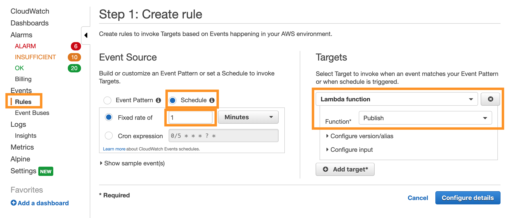

## Collect & De-Identify Data

In this module, you'll see how you can ingest real-time sensor data into **AWS IoT Core**, process it using an **IoT Lambda Rule**, and batch incoming data into S3 using **Kinesis Firehose**. In this case, the Lambda Rule is used to strip the PHI/PII attributes from the incomind data before further processing.

### What was Created

The CloudFormation template that you ran during Set Up deployed the following:

* A **Publish** Lambda function that simulates sensor data and publishes the data to the **LifeSupportDevice/#** IoT Core MQTT Topic.
* A **De-Identify** Lambda function that performs the de-identification, triggered by data coming into the **LifeSupportDevice/#** MQTT Topic.
* A **PatientReference** DynamoDB table that stores encrypted cross-reference data (PUT there by the **De-Identify** Lambda function).
* A **Kinesis Firehose** ingesting de-identified data from the **De-Identify** Lambda function, and storing the data in batches in S3.
* An **S3 bucket** to store the de-identified data.

### Manually Test the Pipeline
Before you start feeding simulated data into the pipeline, you can test the pipeline manually by publishing sensor data to the **LifeSupportDevice/#** MQTT Topic. 

Note the *#* wildcard at the end of the topic name. Since this company deploys machines at many hospitals, they want to be able to organize incoming data by hospital location. Sensor data from life support machines are being published to subtopics such as **LifeSupportDevice/Hospital05/**. You can read more about IoT topics & wildcards [here][iot-topic].

1. Go to the **IoT Core** Console.

1. Navigate to the **Test** tab in the left panel.

1. Type **LifeSupportDevice/#** into the **Subscription topic** text box and click **Subscribe to topic**

	
	
1. This will take you to a view where you can see incoming data as well as publish directly to the topic. In the code box, delete the existing MQTT message and paste this sensor data:


	```
	{
	  "timestamp": "2018-01-27T05:11:50",
	  "device_id": "device8431",
	  "patient_id": "patient9949",
	  "name": "Lastname, Firstname",
	  "dob": "08/27/1972",
	  "temp": 100.3,
	  "pulse": 108.6,
	  "oxygen_percent": 48.4,
	  "systolic": 110.2,
	  "diastolic": 75.6
	}
	```
		
1. You will need to **replace the # wildcard** with a value like **Hospital15** in order to Publish.

	

1. Click **Publish to Topic**. You should immediately see the same message pop up in the window below the code box.

1. The **De-Identify** Lambda function is listening to this topic, so the message you just published should have invoked it.

1. You can see how IoT Core is triggering Lambda by going to the **Act** tab in the left panel.

1. Click on the rule with **DeIdentify** in the name. It will be prefixed by the CloudFormation stack name, and there will be random characters in the suffix.

1. Since the query is `SELECT * FROM 'LifeSupportDevice/#'`, all of the messages sent to the **LifeSupportDevice/#** topic trigger the Lambda function & are processed. However, you can alter this query to filter the data or send only some attributes along.

1. Now go to the **Lambda** console by clicking the **Services** dropdown in the top left corner.

1. Click on the **DeIdentify** Lambda function.

1. Under the **Monitoring** tab, you can see some quick stats on invocation and errors, etc. Since you only sent one message so far, you should only see one dot in each of these graphs.

	

1. You can see some more detail about invocations by clicking on **View logs in CloudWatch**.

1. Click on the latest (closest to the top) **Log Stream**.

1. You should see something like this:

	

1. From these logs, you can see that something was put into a **DynamoDB** table, a **de-identified message** with PII/PHI data removed was created, and then was put into a **Kinesis Firehose**. 

1. You can go to the DynamoDB console and look at the **PatientReference** table (Services > DynamoDB > Tables > PatientReference > Items) to confirm that there is now an item indexed by patient_id and timestamp with the PHI/PII data from the sensor data message.

	

1. Note that the table is encrypted using KMS, but you can see the un-encrypted data in the console since DynamoDB decrypts the data transparently. You can read more about encryption at rest in DynamoDB [here][dynamo-encryption].

### Simulate Sensor Data
Now you will use a scheduled CloudWatch Event to trigger the **Publish** Lambda function and automatically send simulated sensor data into the pipeline you just walked through.

1. Go to the **CloudWatch** console.

1. Under **Events**, click on **Rules**.

1. Click on **Create rule**. 

1. Under **Event Source**, select **Schedule**, and change it to **Fixed rate of 1 Minutes**, so that the function will be triggered every minute.

1. Under **Targets**, click **Add target**.

1. Under **Lambda function**, select the **Publish** function.

	

1. Click **Configure details**, type a name like **publish-sensor-data-every-min** into the **Name** box, and click **Create rule**.

1. Now, if you go back to the IoT Console and Subscribe to **LifeSupportDevice/#** (IoT Core > Test > Subscribe), within a minute, you should see lots of messages coming in from various hospitals.

### Next

:white_check_mark: Continue to the second module: [Enrich Data][enrich].

[iot-topic]: https://docs.aws.amazon.com/iot/latest/developerguide/topics.html
[dynamo-encryption]: https://docs.aws.amazon.com/amazondynamodb/latest/developerguide/EncryptionAtRest.html
[enrich]: ../2_Enrich/

