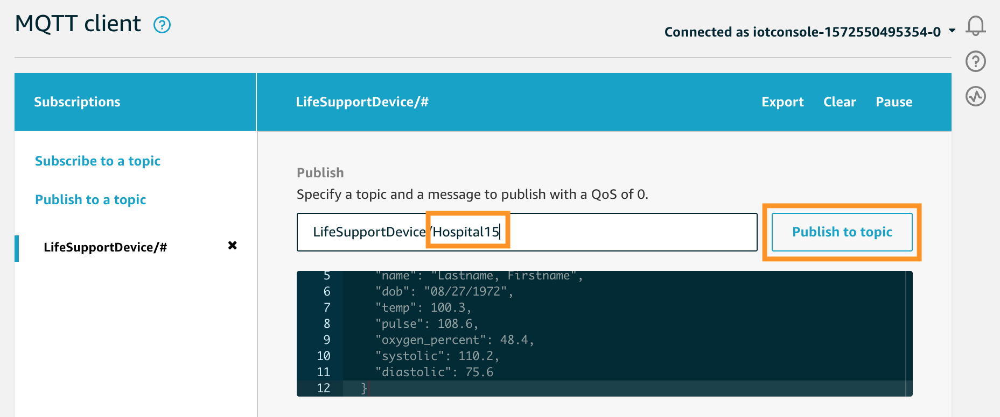

## Collect & De-Identify Data

In this module, you'll see how you can ingest real-time sensor data into **AWS IoT Core**, process it using an **IoT Lambda Rule**, and batch incoming data into S3 using **Kinesis Firehose**.

### What was created

The CloudFormation template that you ran during Set Up deployed the following:

* A **Publish** Lambda function that simulates sensor data and publishes the data to the **LifeSupportDevice/Sensor** IoT Core MQTT Topic.
* A **De-Identify** Lambda function that performs the de-identification, triggered by data coming into the **LifeSupportDevice/Sensor** MQTT Topic.
* A **PatientReference** DynamoDB table that stores encrypted cross-reference data (PUT there by the **De-Identify** Lambda function).
* A **Kinesis Firehose** ingesting de-identified data from the **De-Identify** Lambda function, and storing the data in batches in S3.
* An **S3 bucket** to store the de-identified data.


### Manually Test the Pipeline
Before you start feeding simulated data into the pipeline, you can test the pipeline manually by publishing sensor data to the **LifeSupportDevice/Sensor** MQTT Topic.

1. Go to the **IoT Core** Console.

1. Navigate to the **Test** tab in the left panel.

1. Type **LifeSupportDevice/Sensor** into the **Subscription topic** text box.

	
	
1. This will take you to a view where you can see incoming data as well as publish directly to the topic. In the code box, delete the existing MQTT message and paste this sensor data:


	```
	{
	  "Timestamp": "2018-01-27T05:11:50",
	  "device_id": "device8431",
	  "PatientID": "patient9949",
	  "Name": "lastname firstname",
	  "dob": "08/27/1972",
	  "Temp": 100.3,
	  "pulse": 108.6,
	  "OxygenPercent": 48.4,
	  "systolic": 110.2,
	  "diastolic": 75.6
	}
	```
	
	
	
1. Click **Publish to Topic**. You should immediately see the same message pop up in the window below the code box.

1. The **De-Identify** Lambda function is listening to this topic, so the message you just published should have invoked it.

1. You can see how IoT Core is triggering Lambda by going to the **Act** tab in the left panel.

1. Click on the **DeIdentify** Rule. There may be random characters in the suffix.

1. Since the query is `SELECT * FROM 'LifeSupportDevice/Sensor'`, all of the messages sent to the **LifeSupportDevice/Sensor** topic trigger the Lambda function & are processed. However, you can alter this query to filter the data or send only some attributes along.

1. Now go to the **Lambda** console by clicking the **Services** dropdown in the top left corner.

1. Click on the **DeIdentify** Lambda function.

1. Under the **Monitoring** tab, you can see that the function was invoked recently. But if you don't see data yet, don't worry. Expect about a minute of latency.

1. You can see some more detail about invocations by clicking on **View logs in CloudWatch**.

1. Click on the latest (closest to the top) **Log Stream**.

1. You should see something like this for each invocation of the **DeIdentify** function:

	

1. From these logs, you can see that something was put into a **DynamoDB** table, a **de-identified message** with PII/PHI data removed was created, and then was put into a **Kinesis Firehose**. 

1. You can go to the DynamoDB console and look at the **PatientReference** table (Services > DynamoDB > Tables > PatientReference > Items) to confirm that there is now an item indexed by PatientID and Timestamp with the PHI/PII data from the sensor data message.

1. Note that the table is encrypted (using KMS), but since you have permissions to KMS, you can see the un-encrypted data in the console. TODO check that this is true

1. You can also confirm that the de-identified data was transported successfully via Kinesis Firehose to S3 by visiting the S3 console and going to the **yourinitials-sensor-data** bucket (or whatever bucket name you chose while deploying the CloudFormation template during Set Up).

1. Kinesis Firehose batches incoming messages into files according to buffer size (MB) or time threshold (s), whichever is reached first. In this case, we chose to post a new batch file to S3 every 100 MB of data or every 300 seconds (5 minutes).

1. Kinesis Firehose also PUTs the data into S3 in the following datetime file structure: `year/month/day/hour/`, so you will need to click into several folders before reaching the data file(s).

1. Once you reach a data file, you can download it to view the contents. You should see that the file has JSON data with the patient's PHI/PII (name, date of birth, device ID, temperture, and oxygen percentage) nulled out.

### Simulate Sensor Data
Now you will use a scheduled CloudWatch Event to trigger the **Publish** Lambda function and automatically send simulated sensor data into the pipeline you just walked through.

1. Go to the **CloudWatch** console.

1. Under **Events**, click on **Rules**.

1. Click on **Create rule**. 

1. Under **Event Source**, select **Schedule**, and change it to **Fixed rate of 1 Minutes**, so that the function will be triggered every minute.

1. Under **Targets**, click **Add target**.

1. Under **Lambda function**, select the **Publish** function.

1. Click **Configure details**, type a name into the **Name** box, and click **Create rule**.

1. You can confirm that you were successful by going back to the **Lambda** console and checking the **Invocations** graph under **Monitoring**. You will have to wait a couple minutes for data to start coming into the dashboard.

