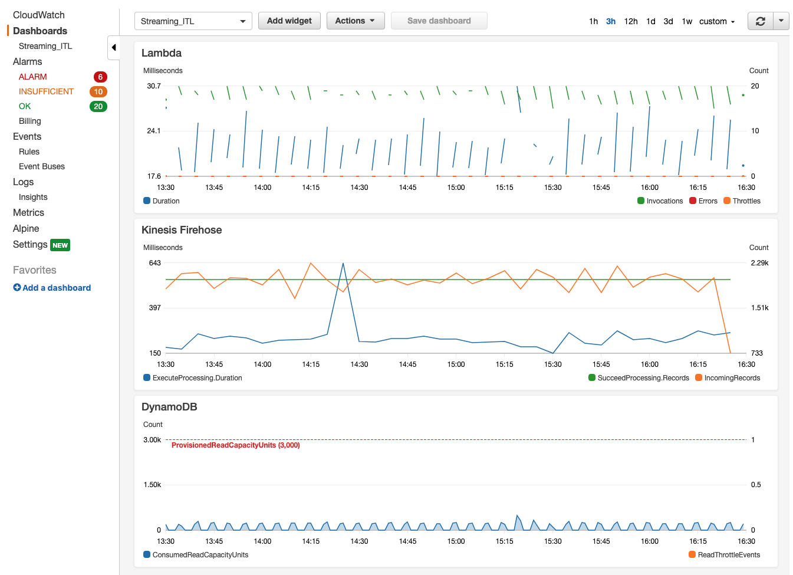

## Enrich Data

In this module, you'll see how you can enrich incoming streaming data with pre-stored metadata. This is helpful for a few reasons. One, with IoT devices sending data so frequently, you want to limit the size of your payloads and not send any data you don't strictly need to. Two, if there is data related to the incoming device data that would aide real-time analytics, it can be added in at this stage, after the data has been ingested into AWS. In this case, the device data is enriched with information such as who manufactured the device. This information can be used later to inform manufacturers if their devices are experiencing anomalies.

### What was Created

The CloudFormation template that you ran during Set Up deployed the following:

* A **Kinesis Firehose** ingesting de-identified data.
* A **Enrich** Lambda function that looks up the metadata in Dynamo, and writes the enriched message back into the Kinesis Firehose.
* A **DeviceDetails** DynamoDB table with metadata.
* An **S3 bucket** to store the enriched data from Kinesis.

### Monitor the Pipeline
To allow you to more easily monitor this section of the pipeline, a CloudWatch dashboard was created that displays Lambda invocations, Kinesis Firehose records, and DynamoDB table reads.

1. Go to the **CloudWatch** console, go to **Dashboards**, and click on the **StreamingITL** dashboard. 

1. You may have to wait a few minutes depending on when you started publishing data in the previous module, but soon you'll see points starting to show up in the dashboard. You can click the refresh button in the top right corner as needed.

1. In this dashboard, you can see how fast data is coming in, and you can keep an eye out for any errors or throttling events. Here is an example from a pipeline that has been running for a few hours:

	

1. You can also confirm that the pipeline is working by checking S3 for transformed records.

1. Go to the **S3** console, and click on the **sensor-data-XXXXXXXX** bucket. The random suffix is there to ensure your bucket name is globaly unique.

1. You should see two folders: **de-identified** and **enriched**. In each of these folders, you will see the de-identified data and the data enriched with device metadata respectively. These files were PUT here by Kinesis Firehose.

	Kinesis Firehose batches incoming messages into files according to buffer size (MB) or time threshold (s), whichever is reached first. In this case, we chose to post a new batch file to S3 every 1 MB of data or every 60 seconds.

	Kinesis Firehose also PUTs the data into S3 in the following datetime file structure: `year/month/day/hour/`, so you will need to click into several folders before reaching the data file(s).

1. Once you reach a data file, you can download it to view the contents. 

	

1. You should see that the file has JSON data with the patient's **PHI/PII** (name, date of birth, temperature, oxygen percentage) **nulled out**. Additionally, in the **enriched data** folder, you will see the additional attributes: manufacturer, model.

	Here is an example from an **enriched** file:

	

### Next

:white_check_mark: Continue to the third module: [Detect Anomalies][detect-anomalies].

[kdg-help]: https://awslabs.github.io/amazon-kinesis-data-generator/web/help.html
[kdg]: https://awslabs.github.io/amazon-kinesis-data-generator/web/producer.html
[detect-anomalies]: ../3_DetectAnomalies/