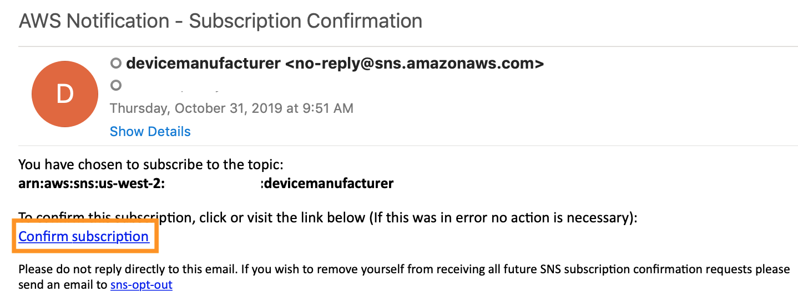

## Detect Anomalies

In this module, you'll see how you can use **Kinesis Analytics** to analyze streaming data in near real-time as it is ingested. In this case, the Random Cut Forest algorithm is used to generate anomaly scores. You'll be sent an email whenever an anomaly in the streaming data is found.

### What was Created

The CloudFormation template that you ran during Set Up deployed the following:

* A **Device Data Analytics** Kinesis Analytics Application, taking **IngestStream** data as an input, and calculating anomaly_scores.
* A **OutputStream** Kinesis Firehose which takes the **Device Data Analytics** data and puts it into the S3 **sensor-data-XXXXXXXX** bucket.
* A **Alert** Lambda function triggered from **OutputStream**, which sends an SNS notification whenever an anomaly_score above/below the threshold is found.
* A **device manufacturer** SNS Topic for email notifications

### Sign up for Notifications

1. Go to the **SNS** console.

1. Under **Topics**, click on the **devicemanufacturer** topic.

1. Click **Create subscription**, select the **Email** protocol, and type in an email that you can access.

1. Click **Create subscription**.

1. You will get an email at the address you provided. It will be titled **AWS Notification - Subscription Confirmation** from **devicemanufacturer**. Click **Confirm subscription** when you get the email. If you don't receive it within a few minutes, check your spam folder.
	
	

### Monitor the Pipeline

1. Go to the **Kinesis** console.

1. Select **Data Analytics** on the left-hand side.

1. Select the **DeviceDataAnalytics** Kinesis Data Analytics Application.

1. Click on the **Actions** dropdown, and click **Run Application**. Confirm that you want to run the application.

	

1. Once it's running, click on **Application details**.

1. Under **Streaming data**, you can see that this application is taking data in from **IngestStream** and applying the **FirehoseTransform** Lambda function to enrich the data with manufacturer and model information.

1. Under **Destination**, you can see that the results are being sent to **Output Stream**. 

1. Click on **Go to SQL results** to see what's happening in real-time.

1. In the SQL statement being used, you can see where Kinesis Analytics is calling the [Random Cut Forest algorithm][random-cut]:

	

1. Under the **Source** tab, you can see incoming records from **IngestStream**. 

	If you see the message **No rows in source stream**, this means that there aren't any incoming records at that moment. That may happen due to Kinesis Firehose buffering data, or since the Publish Lambda function only runs once a minute. Wait a few seconds and try again by clicking **Retrieve rows**.

1. Click on the **Real-time Analytics** tab.

1. In the **DEST_STREAM**, you should see data rows including an **ANOMALY_SCORE** that was calculated using the Random Cut Forest algorithm.

1. If an anomaly score is returned above the threshold, you will be emailed at the email you provided during set up.

	The threshold was determined by collecting anomaly scores from a sample data set and finding the mean anomaly score. The chosen threshold is three standard deviations above/below the mean.

	You should notice that the **pulse** in the email alerts sent to you are very low (below 60). This is the anomaly that was simulated that Kinesis Analytics has picked up on!

	

1. Once you're done, you can stop the application in order to stop recieving email alerts. 

	You can do this from the Kinesis Analytics Console. From the Actions dropdown, select **Stop application**. You may recieve some emails for a minute or so after you've stopped the application.

1. You can confirm that there is now an **anomaly_scores** folder in the **sensor-data-XXXXXXXX** S3 bucket with the same data you see in the **DEST_STREAM**. You'll also notice that there's an **anomaly** field with a true or false result. This indicates whether it was flagged as anomolous or not by the **Alert** Lambda function.

### Next

:white_check_mark: [Clean Up][cleanup].

[random-cut]: https://docs.aws.amazon.com/kinesisanalytics/latest/sqlref/sqlrf-random-cut-forest.html
[cleanup]: ../4_CleanUp/