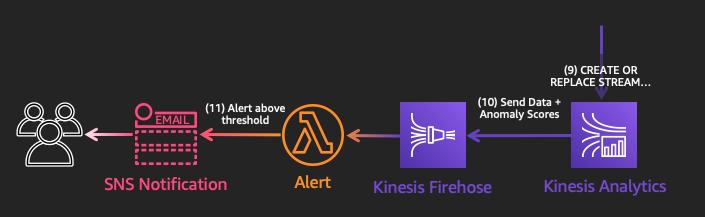

## Detect Anomalies

In this module, you'll see how you can use **Kinesis Analytics** to analyze streaming data in near real-time as it is ingested. In this case, we use the [Random Cut Forest algorithm][random-cut] to generate anomaly scores. You'll be sent an email in near real time, whenever an anomaly is detected.

### What was Created

The CloudFormation template deployed the following:

* A **Device Data Analytics** Kinesis Analytics Application, taking **IngestStream** data as an input, and calculating anomaly_scores.
* A **OutputStream** Kinesis Firehose which takes the **Device Data Analytics** data and puts it into the S3 **sensor-data-XXXXXXXX** bucket.
* An **Alert** Lambda function triggered from **OutputStream**, which sends an SNS notification whenever an anomaly_score above the threshold is found.
* A **device manufacturer** SNS Topic for email notifications

### Set Up Notifications & Analytics
We want to send manufacturers notifications whenever their devices might be malfunctioning. In this workshop, we will simply forward all anomalies to the email you provide.

In a real-life scenario, we would want to filter this data to only send a manufacturer the data from their devices. We might also want to pre-process and/or aggregate the data before sending it to individual manufacturers so that we can help them prioritize which data to look at. 

1. Subscribe yourself to the **devicemanufacturer** SNS topic. 

	> Make sure to check your email to confirm the subscription before proceeding.

	

<strong>Step by Step Instructions</strong>

	1. Go to the **SNS** console.

	1. Under **Topics**, click on the **devicemanufacturer** topic.

	1. Click **Create subscription**, select the **Email** protocol, and type in an email that you can access.

	1. Click **Create subscription**.

	1. You will get an email at the address you provided. It will be titled **AWS Notification - Subscription Confirmation** from **devicemanufacturer**. Click **Confirm subscription** when you get the email. If you don't receive it within a few minutes, check your spam folder.
	
		
		
	

1. Run the **DeviceDataAnalytics** Kinesis Analytics Application.

	

	
<strong>Step by Step Instructions</strong>

	1. Go to the **Kinesis** console.

	1. Select **Data Analytics** on the left-hand side.

	1. Select the **DeviceDataAnalytics** Kinesis Data Analytics Application.

	1. Click on the **Actions** dropdown, and click **Run Application**. 

		**Confirm** that you want to run the application.

		
	
	

### Monitor the Pipeline

1. Now that the application is running, click on **Application details** and explore what is happening.

	Under **Streaming data**, you can see that this application is taking data in from **IngestStream** and applying the **FirehoseTransform** Lambda function to enrich the data with manufacturer and model information.

	You will also see the **In-application stream name**, SOURCE\_SQL\_STREAM\_001, which is how it will be referenced in the SQL code.

	Under **Destination**, you can see that the results are being sent to **OutputStream**. 

1. Click on **Go to SQL results** to see what's happening in real-time.

	In the SQL statement being used, you can see where Kinesis Analytics is calling the [Random Cut Forest algorithm][random-cut] and applying it to the incoming data from IngestStream:

	
	
	The Random Cut Forest algorithm is applied to the incoming data in near real time, and is being applied as an [Analytic Function][analytic-func].

	You can change the data window and performance of the algorithm by adjusting the following parameters: numberOfTrees, subSampleSize, timeDecay, and shingleSize. In this case, we have chosen to leave these parameters as their [default values][rcf-params].
	
	Explore other built-in functions that you can apply to streaming data using Kinesis Analytics [here][kinesis-analytics-funcs].

1. Under the **Source** tab, you can see incoming records from **IngestStream**. 

	If you see the message **No rows in source stream**, this means that there aren't any incoming records at that moment. That may happen due to Kinesis Firehose buffering data, or since the Publish Lambda function only runs once a minute. Wait a few seconds and try again by clicking **Retrieve rows**.

1. Click on the **Real-time Analytics** tab.

	In the **DEST_STREAM**, you should see data rows including an **ANOMALY_SCORE** that was calculated using the Random Cut Forest algorithm.

1. If an anomaly score is returned above the threshold, you will be emailed at the email address you provided during set up.

	The threshold was determined by collecting anomaly scores from a sample data set and finding the mean anomaly score. The chosen threshold is [three standard deviations above the mean][stdev-wiki].
	
	Try to figure out what anomaly the algorithm is picking up on!
	
	

	
<strong>Find out what the anomaly is</strong>

	The data simulation has been manufacturing an anomaly by occassionaly sending out extremely low **pulse** values (below 60).

	
	
	

1. Once you're done, you can stop the application in order to stop recieving email alerts. 

	

	
<strong>Step by Step Instructions</strong>

	Go to the Kinesis Analytics Console by going to the **Kinesis** console and selecting **Data Analytics** on the left-hand side. 

	From the Actions dropdown, select **Stop application**. You may recieve some emails for a minute or so after you've stopped the application.
	
	

1. You can confirm that there is now an **anomaly_scores** folder in the **sensor-data-XXXXXXXX** S3 bucket with the same data you see in the **DEST_STREAM**. You'll also notice that there's an **anomaly** field with a true or false result. This indicates whether it was flagged as anomolous or not by the **Alert** Lambda function.

### Next

:white_check_mark: [Clean Up][cleanup].

[stdev-wiki]: https://en.wikipedia.org/wiki/68%E2%80%9395%E2%80%9399.7_rule
[random-cut]: https://docs.aws.amazon.com/kinesisanalytics/latest/sqlref/sqlrf-random-cut-forest.html
[analytic-func]: https://docs.aws.amazon.com/kinesisanalytics/latest/sqlref/sql-reference-analytic-functions.html
[rcf-params]: https://docs.aws.amazon.com/kinesisanalytics/latest/sqlref/sqlrf-random-cut-forest.html#random-cut-forest-parameters
[kinesis-analytics-funcs]: https://docs.aws.amazon.com/kinesisanalytics/latest/sqlref/sql-reference-functions.html
[cleanup]: ../4_CleanUp/