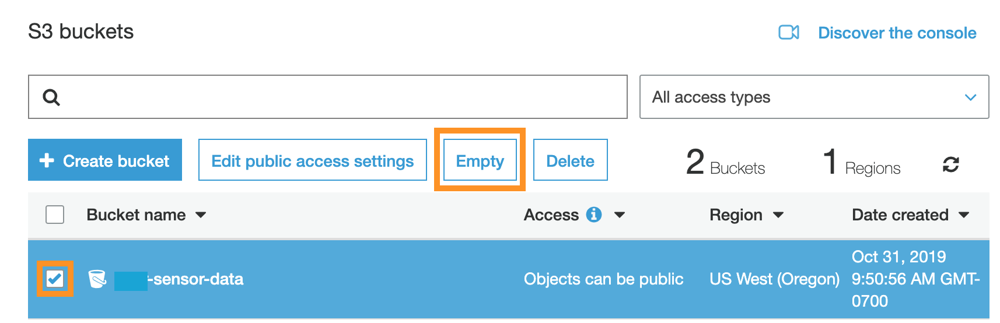
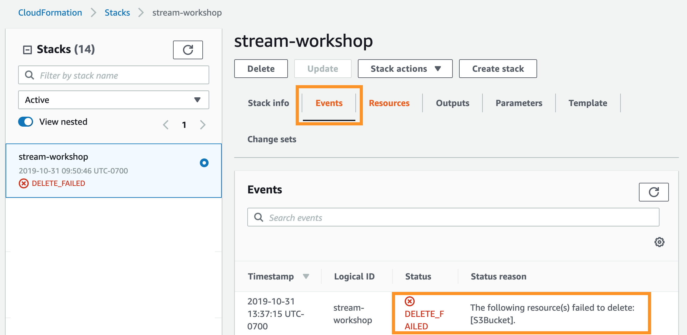

## Clean Up

If you are at an event that is providing pre-set up accounts, there is no need to clean up your resources at the end of the event. 

Thanks for attending and please provide feedback to your presenter!

<strong>Follow these steps if you are completing this workshop by yourself, or if your event isn't using pre-set up accounts</strong>

Since most of the architecture was created by running a CloudFormation template, you can clean up most of what you did today by deleting the CloudFormation stack. 

However, CloudFormation won't delete any S3 buckets that have data in them, so first you will need to empty the S3 bucket with the sensor data in it.

You will also need to manually clean up any resources you created outside of the workshop CloudFormation stack. 

1. Go to the **CloudWatch** console under **Rules**, and delete the CloudWatch Event **publish-sensor-data-every-min**.

1. Go to the **S3** Console.

1. Click on the checkbox next to the **sensor-data-XXXXXXXX** bucket. 

1. Click **Empty**.

	

1. Go to the **CloudFormation** Console.

1. Click on the stack you created during set up.

1. Click **Delete**.

	Kinesis may continue to send data after you've emptied the S3 bucket. If that happens, you will see that the CloudFormation stack has the status **DELETE_FAILED**, and under **Events**, you will see the **Status Reason**: "The following resource(s) failed to delete: [S3Bucket]." 

	If that happens, empty the S3 bucket again, and delete the stack once more.

	
	

