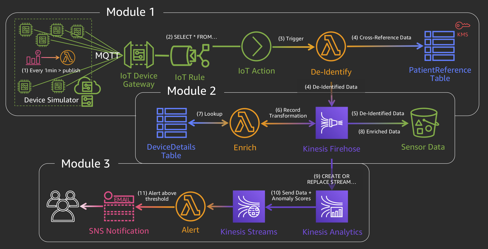

## Serverless Stream Processing at Scale

In this workshop, you will explore several patterns for stream processing at scale in AWS. The methods used here are based on the [Serverless Streaming and Architecture Best Practices White Paper][whitepaper].

Imagine that you are at a health care company that deploys equipment in hospitals across the globe. The equipment collects patient data, and you need to ingest and analyze the data at scale, in near real-time, in a HIPAA compliant manner. 

In this workshop, you will deploy and explore the architecture below, which takes in simulated life support device sensor data and processes it. The entire architecture is serverless and uses [HIPAA-eligable services][compliance].

### Modules

This workshop is divided into three modules. You must complete [Set Up][setup] before starting any of the other modules.

| | Module | Description |
| --- | :---: | :--- |
| 0 | [Set Up][setup] | Deploy the architecture using a [CloudFormation][cloudformation] template. |
| 1 | [Collect & De-Identify Data][collect-deidentify] | Ingest simulated real-time device data into [IoT Core][iotcore], de-identify the data using an IoT [Lambda][lambda] Action, saving the PHI/PII data to an encrypted [DynamoDB][dynamo] table while sending PHI/PII-free data on to [S3][s3] via [Kinesis Firehose][firehose]. |
| 2 | [Enrich Data][enrich] | Enrich streaming data using a [Kinesis Firehose][firehose] Record Transformation with metadata from [DynamoDB][dynamo], and then store the enriched records in [S3][s3]. |
| 3 | [Detect Anomalies][detect-anomalies] | Use [Kinesis Analytics][analytics] to calculate anomaly scores with the Random Cut Forest algorithm, and automatically send an [SNS][sns] text message if an anomaly is found. |

[whitepaper]: https://d1.awsstatic.com/whitepapers/Serverless_Streaming_Architecture_Best_Practices.pdf
[compliance]: https://aws.amazon.com/compliance/services-in-scope/
[cloudformation]: https://aws.amazon.com/cloudformation/
[iotcore]: https://aws.amazon.com/iot-core/
[lambda]: https://aws.amazon.com/lambda/
[dynamo]: https://aws.amazon.com/dynamodb/
[s3]: https://aws.amazon.com/s3/
[firehose]: https://aws.amazon.com/kinesis/data-firehose/
[analytics]: https://aws.amazon.com/kinesis/data-analytics/
[sns]: https://aws.amazon.com/sns/
[setup]: 0_SetUp/
[collect-deidentify]: 1_CollectDeIdentify/
[enrich]: 2_Enrich/
[detect-anomalies]: 3_DetectAnomalies/